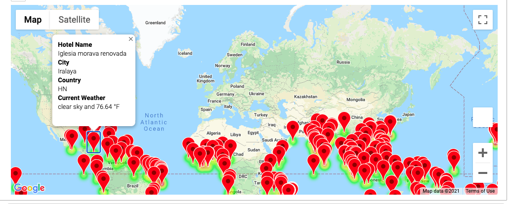
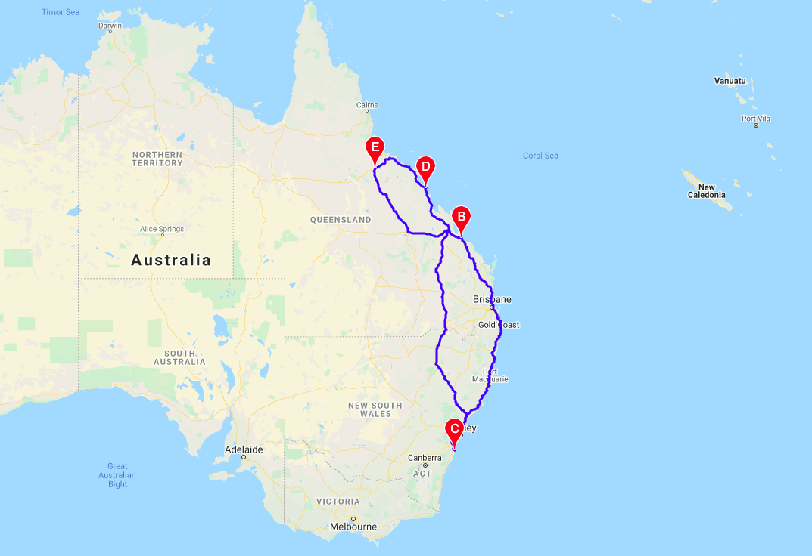
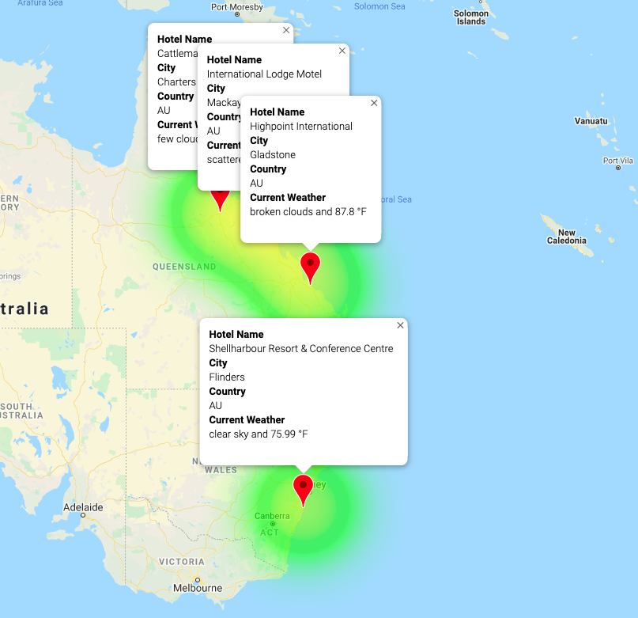

# World_Weather_Analysis

## Overview of Project

### Purpose
The purpose of this project is to create a Python script for a hypothetical travel company that will use input statements to filter potential travel destinations worldwide. After selecting four cities to create a travel itinerary, Google Maps Platform APIs are used to create travel routes and a markup map.

### Methodology

To start this project, it was necessary to create a data file containing city information, including weather and location data. I began by generating a random set of 2,000 latitude and longitude combinations using the NumPy .random.uniform() method. These coordinates are then used with citipy to get the nearest city. If an insufficient number of cities are generated, rerun the code or expand the size of the random search. I then performed an API call using OpenWeatherMap (Current Weather Data) and parsed the JSON for the needed data. After looping through all of the cities, the data is added to a DataFrame and it is then exported into a .csv file.

## Results
The user will be asked for the minimum and maximum temperature they would like for thier trip. With the .csv file generated in the previous section, the Pandas .loc[] method is used to filter the data based on the user input. Using the Google Places API, a hotel is found that is within 5,000 meters of each city by iterating through the DataFrame with the given parameters. This new DataFrame is used to create an updated .csv file with Hotel information. Using a customized info box, gmaps marker_layer, and heat_layer, the user is presented with an interactive map to look search for travel destinations. Please see the screenshot below.

### Images for Reference

## Travel Itinerary
The final section of this project is to create a travel itinerary map. After the user selects four destinations, a vacation itinerary route is created with the starting and ending cities being the same location. The three other destinations are refferred to as "stop1", "stop2", and "stop3." Using the Pandas .loc[] method on the new DataFrame with hotel data, individual DataFrames are created for each of the destinations. Latitude-Longitude pairs are obtained from each destination DataFrame using the to_numpy function. Using these coordinate pairs with the Google Directions API, a driving route is created for the vacation itinerary as seen below.

Finally, the four separate destination DataFrames are combined into a single itinerary DataFrame using the Pandas .concat() function. The ending result is seen in the figure below.

